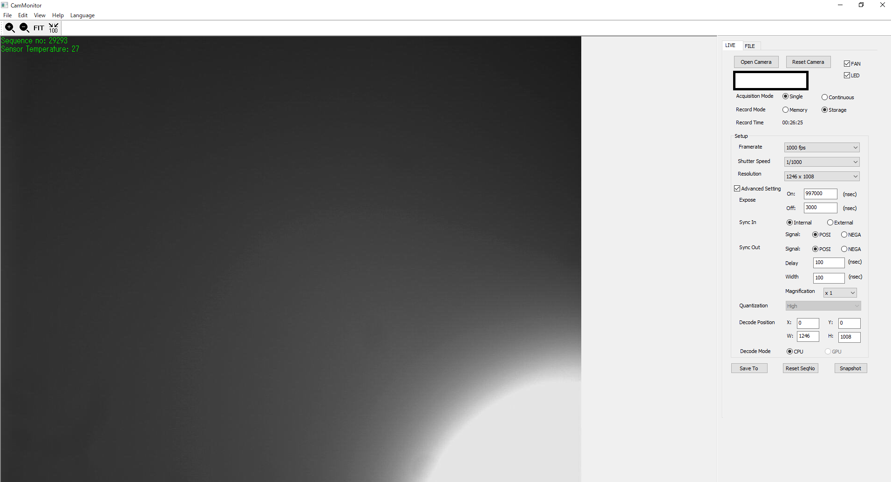
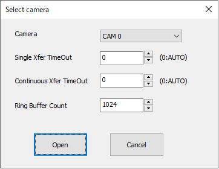
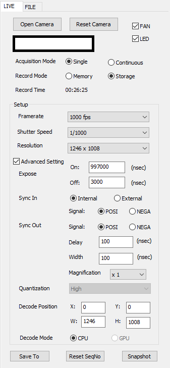
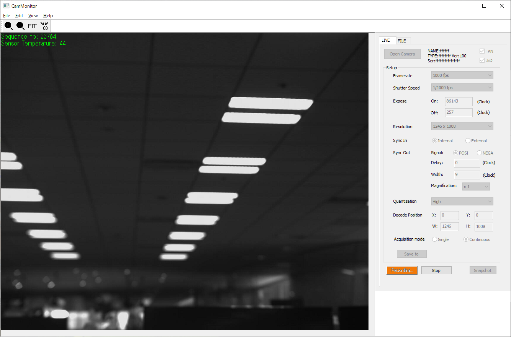
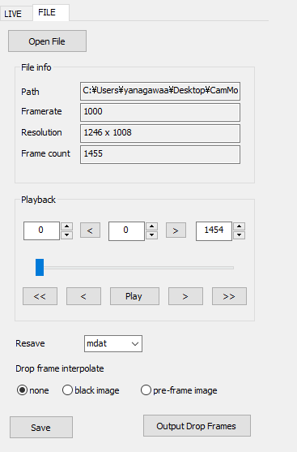

# CamMonitor



<hr>

CamMonitor is sample code for [INFINICAM UC-1](https://www.photron.co.jp/products/hsvcam/infinicam/). Developped by C++ MFC.

This sample code includes all functions of INFINICAM SDK [PUCLIB](https://www.photron.co.jp/products/hsvcam/infinicam/tech.html). You can experience all the features using this application.
Let's start development using INFINICAM UC-1!

## How to Use


1. Start CamMonitor and select "Camera". "CAM 0" is the first camera detected.
2. Set the transfer parameters, If you want to set it other than the default.
3. Click the [Open] button to start displaying the Live image. 



4. On the Live view, you can change camera parameters and check the Live image.



5. Change the Acquitision mode to "continuous" before start recording.
6. Click the [Record] button to start recording.



7. Click the [FILE] tab to playback the recorded image.
8. Click the [Open File] button and select the image file (select .cih file).
9. Click the [Play] button to start playback.


## Prerequisites
* Installed Visual Studio 2019

    :warning: The MFC Package is required. 

## Build
1. Download and install [PUCLIB](https://www.photron.co.jp/products/hsvcam/infinicam/tech.html) SDK.

2. Clone this source code.
   
3. Open [CamMonitor.sln](https://github.com/infinicam/CamMonitor/blob/master/CamMonitor.sln) on visual studio.

4. Build.

### Advanced Setting

INFINICAM UC-1 can control quantization parameters for compress the image. If you want to set the parameters, please change the following code. 

```c
LiveTab.cpp
void CLiveTab::UpdateControlState()
{
    ~~
    GetDlgItem(IDC_QUANTIZATION)->EnableWindow(FALSE);
}
```
to

```c
void CLiveTab::UpdateControlState()
{
    ~~
    GetDlgItem(IDC_QUANTIZATION)->EnableWindow(bOpened && !bContinuous);
}
```

#### Developed by:

