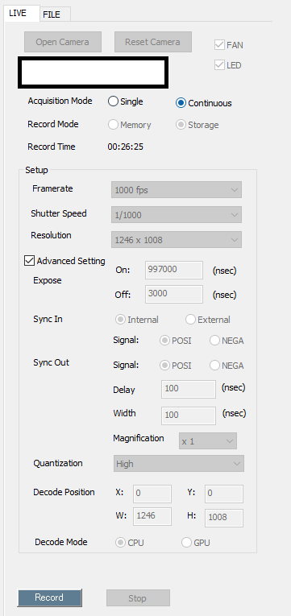

# CamMonitor


<hr>

CamMonitor is sample code for [INFINICAM UC-1](https://www.photron.co.jp/products/hsvcam/infinicam/). Developped by C++ MFC.

This sample code includes all functions of INFINICAM SDK [PUCLIB](https://www.photron.co.jp/products/hsvcam/infinicam/tech.html). You can experience all the features using this application.
Let's start development using INFINICAM UC-1!

# How to Use

## How to connect

### Auto connection

When you start CamMonitor with the INFINICAM UC-1 connected to your PC, it will automatically connect and start in Continuos Mode.

### Manual connection


1. Open Camera Crick.
2. Start CamMonitor and select "Camera". "CAM 0" is the first camera detected.
3. Set the transfer parameters, If you want to set it other than the default.
4. Click the [Open] button to start displaying the Live image. 

## Live Tab


5. On the Live view, you can change camera parameters and check the Live image.

### Record Mode

* Memory
    * The video is temporarily saved in the PC's memory, and then saved to storage after shooting is complete. It is shot with the end trigger.
* Storage
    * The video is streamed and saved in the PC's storage. It is recorded with a start trigger.

### Record Time

The maximum shooting time is listed below.

* Memory
    * You can specify the shooting time. If the shooting time is long, it will take some time to save.
* Storage
    * You cannot specify the shooting time.

### Save To

You can specify the name and location of the captured file.

The timestamp is added to the end of the file name.

* The default is as follows:
    * Save file path: Desktop
    * Save file name: CamMonitor



5. Change the Acquitision mode to "continuous" before start recording.
6. Click the [Record] button to start recording.

## File Tab


7. Click the [FILE] tab to playback the recorded image.
    
    If there is a video recorded just before, it will be automatically selected and displayed.
8. Click the [Open File] button and select the image file (select .cih file).
9. Click the [Play] button to start playback.

### Resave

You can resave the video that you are currently viewing.

You can specify the frame in Playback. Enter the start frame in the left spin box and the end frame in the right spin box.

When re-saving, please use the Save combo box to change the format.

### Drop frame interpolate

When saving streaming, shot frames may be dropped due to the influence of SSD or PC specifications, etc. Here you can decide how to handle dropped frames when saving.

* Non: Do nothing
* black image: Insert a black image
* pre-frame image: Insert the image of the pre-frame image

## Prerequisites
* Installed Visual Studio 2019

    :warning: The MFC Package is required. 

## Build
1. Download and install [PUCLIB](https://www.photron.co.jp/products/hsvcam/infinicam/tech.html) SDK.

2. Clone this source code.
   
3. Open [CamMonitor.sln](https://github.com/infinicam/CamMonitor/blob/master/CamMonitor.sln) on visual studio.

4. Build.

### Advanced Setting

INFINICAM UC-1 can control quantization parameters for compress the image. If you want to set the parameters, please change the following code. 

```c
LiveTab.cpp
void CLiveTab::UpdateControlState()
{
    ~~
    GetDlgItem(IDC_QUANTIZATION)->EnableWindow(FALSE);
}
```
to

```c
void CLiveTab::UpdateControlState()
{
    ~~
    GetDlgItem(IDC_QUANTIZATION)->EnableWindow(bOpened && !bContinuous);
}
```

#### Developed by:

