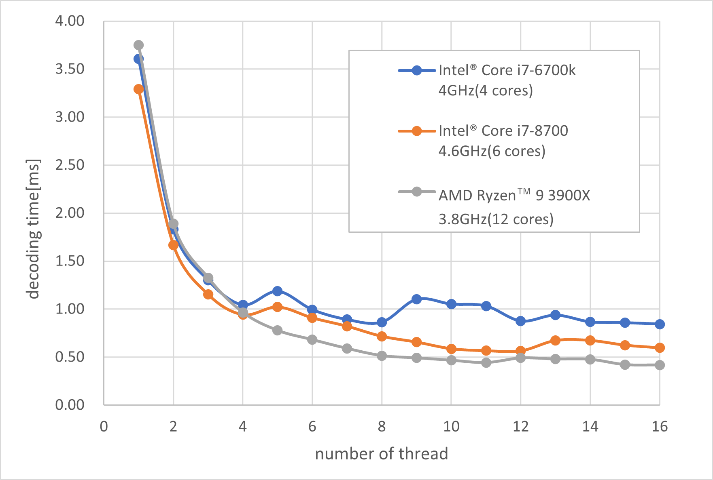

# SingleImage

SingleImage is quick sample code to use [INFINICAM UC-1](https://www.photron.co.jp/products/hsvcam/infinicam/). Developeed by C language.

This sample code implements the function to get image and decode using INFINICAM SDK [PUCLIB](https://www.photron.co.jp/products/hsvcam/infinicam/tech.html).


## Enviroment
* installed Visual Studio 2019

## Build
1. Download and install [PUCLIB](https://www.photron.co.jp/products/hsvcam/infinicam/tech.html) SDK.

2. Clone repository.
   
3. Open solution file on visual studio.

4. Build

## Multi thread decode
You can change the code below to switch decoding between single thread and multi thread.

```c
// Note:Switch decoding to multi threading
#define MULTITHREAD_DECODE


#ifdef MULTITHREAD_DECODE
	result = PUC_DecodeDataMultiThread(pDecodeBuf, 0, 0, nWidth, nHeight, nLineBytes, xferData.pData, q, 8);
#else
	result = PUC_DecodeData(pDecodeBuf, 0, 0, nWidth, nHeight, nLineBytes, xferData.pData, q);
#endif // MULTITHREAD_DECODE
```

This is the results of decode in threads. 



#### developped by:

