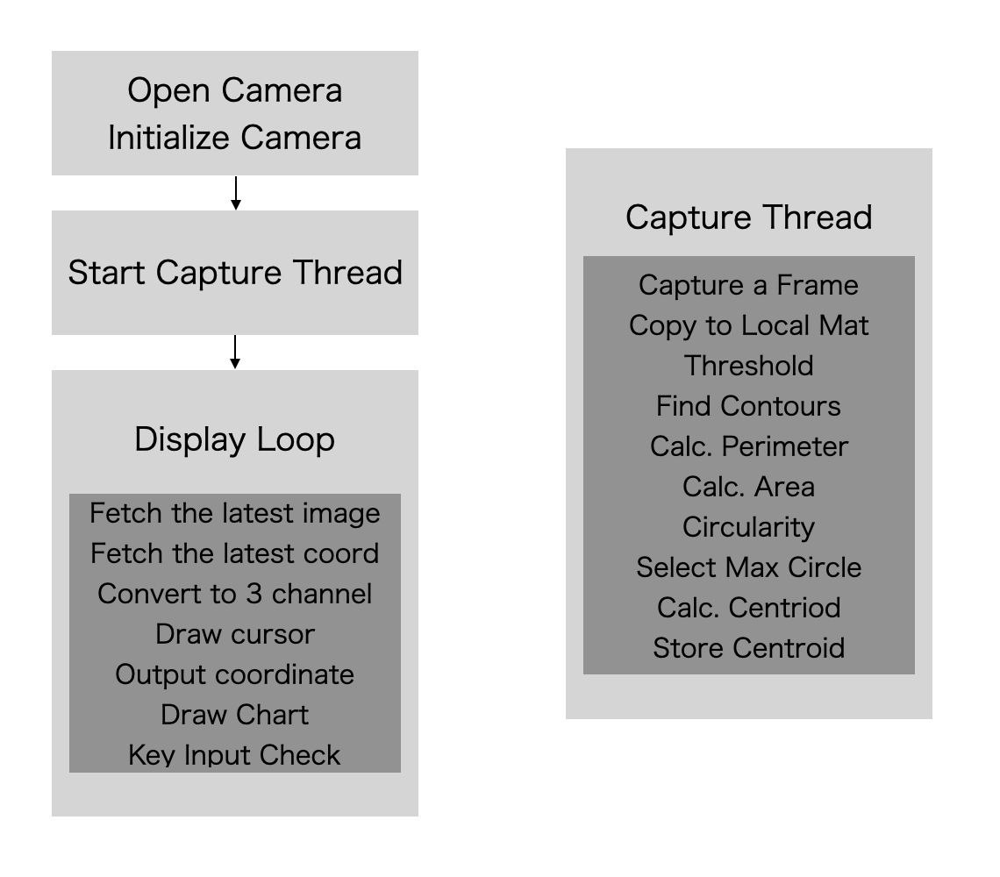

# bladeTrack

bladeTrack is a Windows sample application for USB high-speed streaming camera [INFINICAM UC-1](https://www.photron.co.jp/products/hsvcam/infinicam/) and its SDK with OpenCV.

It illustrates how the INFINICAM could be used to achieve real-time live image processing with simple capturing API. As the nature of high speed live image processing, dealing with the limited performance of host PC and massive streaming data is the key to construct an efficient analyzing system.

In contrast to the frame by frame image analysis for the pre-recorded file, live image analysis requires immediate feedback to the high-speed phenomenon, which should minimize the overhead at each frame processing while displaying the necessary visual information and interacting with users and other peripheral equipments.

This strategy essentially differentiate the program design from the usual OpenCV video processing code.

The sample application "bladeTrack" explains most simple scheme of capture / process thread in conjunction with the live display. Users can easily modify the processing code to build the custom processing software maintaining the high speed capture and moderate rate of GUI display.

## What is bladeTrack?

Fan blade rotates very quickly even in the slow mode. If it rotates ten rounds per second, the angle is 3600 degree. If you film the fan with normal 30fps camera, it rotates 120 degree per frame. Even if you used very short shutter duration or used a strobe light, you can get just three images at every one round of the blade.

As you can imagine, 30fps camera could not deliver meaningful information even using sophisticated image processing.

Now INFINICAM UC-1 can capture up to 1000 frame per second, which means 33 times more image than the 30fps camera. By applying some image detection process, we are now able to get the far detailed rotating information.

We put a circle shape sticker as a marker on one of the blades. The application will output the x-y coordinate of the centroid of the circle in the screen space.

The software shows the detected centroid position with a cross cursor on the live image in real time (but not in 1000 fps) and plots the x-y coordinate in the white chart window, as well as the printf output of the coordinates and time to the command prompt window.

  

## Environment
* installed Visual Studio 2019

    :warning: MFC Package is required.

* OpenCV Version 4.2.0 or higher (included in the Photron GitHub repository)

## Build
1. Download and install [PUCLIB](https://www.photron.co.jp/products/hsvcam/infinicam/tech.html) SDK.

2. Clone this source code.

3. Set the environment variable OPENCV_DIR and set to the directory you installed OpenCV

4. Copy the OpenCV DLL's to the bin folder
   
5. Open [bladeTrack.sln](./bladeTrack.sln) on visual studio.

6. Build

------------

## Operation

1. Prepare circle shape marker that would be more than 100 pixels of radius length in the screen.
2. Stick the marker on any moving object like fan blade, metronome or even on your wrist. The contrast is important. You should use a white marker on a dark object or a black marker on a bright object.
3. Connect INIFINICAM UC-1 to your Windows PC with USB-C cable.
4. Launch bladeTrack.exe in the bin folder.
5. Shoot the marker motion in front of the camera.
6. You can see the cross cursor of the biggest circle in the live window and the X-Y coordinate in the chart.
7. To exit, hit ESC key after focusing to the live window.

(Vertical black bar indicates the second unit in time.)

## Detection Algorithm

We use the following algorithm to detect the centroid coordinate of the marker:

1. Deep copy the captured frame into an OpenCV Mat. It is needed to avoid tearing the image from two adjacent frames.
2. Threshold the image into black and white image.
3. Detect contours from the image.
4. For each closed contours, calculate the perimeter and the area space.
5. Calculate the square of the perimeter and divide it by the area as the circularity.
6. If the circularity is smaller than 15 then mark it as a candidate.
7. Select the biggest contour from the candidates.
8. Get the envelop rectangle and calculate the centroid.

## Program structure

## Program Hints

1. To capture / process as many image as possible to the software, the capture / process part forms a function and runs as a different thread.
2. Because the camera encodes the image to a compressed format to suppress the bit rate, the image needs to be decoded on PC. Since the decoding is rather heavy process, it requires multithread distribution. This is a different layer of thread than the above capture thread.
3. The display refresh depends on the OpenCV draw/show frequency. The main thread tries to get the latest captured image and detected coordinates once it is ready to start display. This means that the live image and the cross cursor don't show up at every frame. Most of them are not displayed.
4. The chart on the other hand, needs to show all the data. All the detected coordinates are stored in an array (vector < Point > centerCoord). The main thread can access to entire data all the time. When it draws the chart, the latest N frames data is extracted and used to plot.
5. When doing the capture and process in the capture thread, std::mutex protects the data. When fetching the latest image and the associated data in the main thread, again std::mutex protects the data. If you don't use mutex, the image and the data of the GUI might be overridden by the fast capture process thread.

#### developed by: Photron Ltd.
