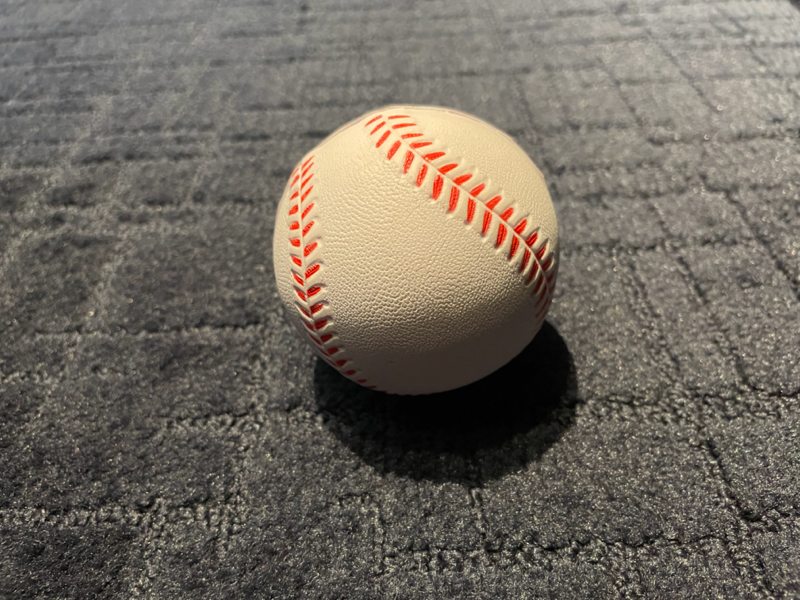
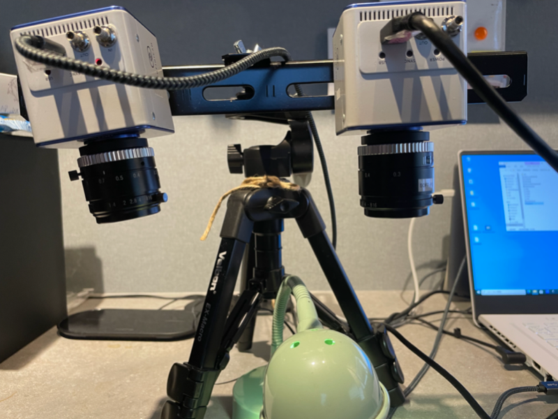
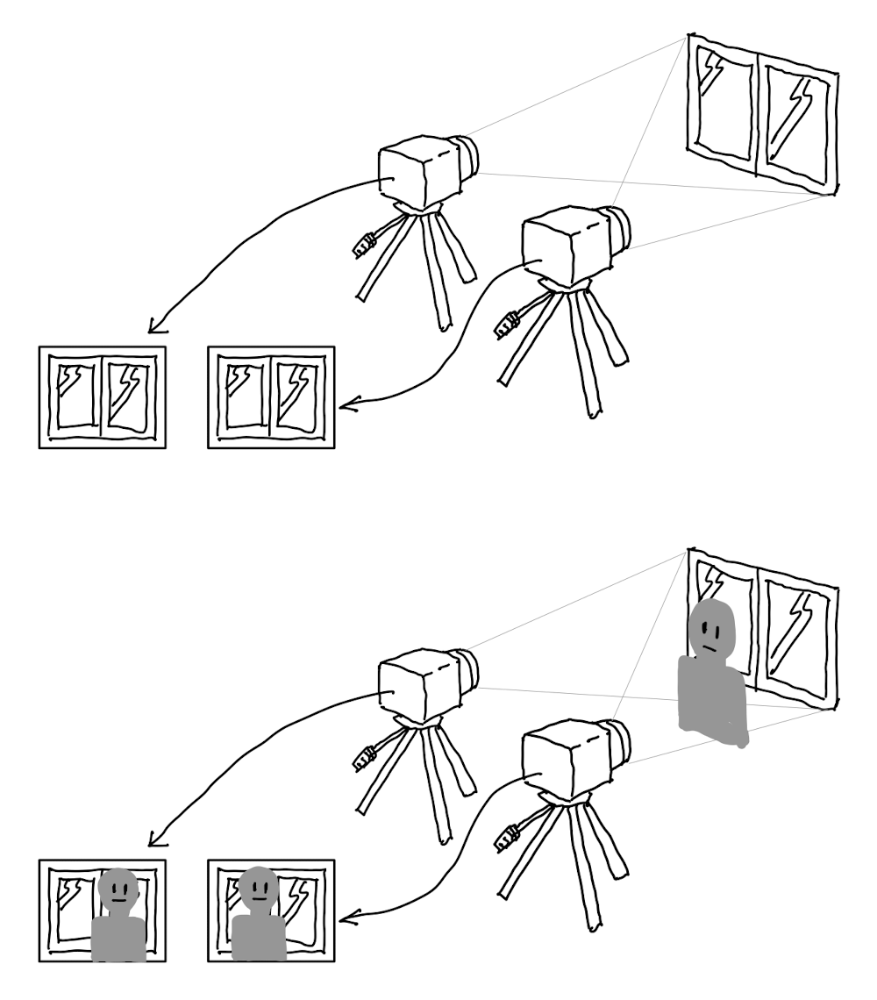
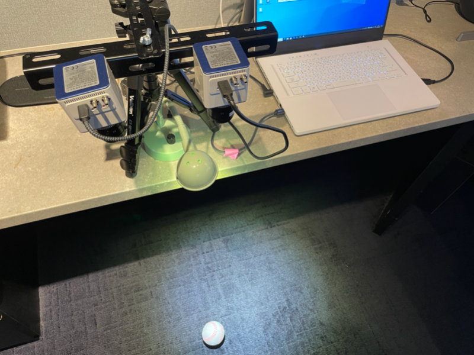

# eyes


<hr>

"eyes" is a Windows sample application for the USB high-speed streaming camera [INFINICAM UC-1](https://www.photron.co.jp/products/hsvcam/infinicam/) and its SDK with OpenCV.

It is an example program for stereo scope imaging. Using two Infinicam cameras connected to a Windows PC, the application creates a depth map, which represents the distance of the objects from the cameras at each pixel. By using multi-thread programming, just like the bladeTracker sample, it tries to process as many fps as possible regardless of the display refresh rate.
"eyes" program also enjoys two sophisticated acceleration tequniques from Infinicam SDK. "Vertical Cropping" and "Proxy Access". 

You can find how easy it is to use two cameras that are controlled by an application. 
## What is eyes?



"eyes" generates a “Depth Map”.

Depth mapping means creating pixel by pixel depth map that represents the distance from the camera to the object surface.

Once you got the synchronized stereo image pair, the epipolar geometry calculations can be done by the OpenCV library. OpenCV offers several kinds of stereo matching functions. The “eyes” application uses the simplest and the fastest “StereoBM(Block Matching)”. 

Essentially, StereoBM function generates the depth map by comparing two images and check the relative difference of the matched block position to define how far is the interest object positioned from the cameras. For example, place two cameras at five inches apart from each other but at the same height. Then direct the cameras to a window frame so as to have the almost same view from the two cameras. Now if you stand in front of the window, your position in the cameras are horizontally different because of the visual camera difference.



While the matched location of the window’s corner should be almost the same, the matched location of your face should have some difference. StereoBM calculates the distance of the difference and then transform it to the depth distance. The depth distance is calculated for every pixels and recorded in an image called the depth map. 

The application “eyes” uses OpenCV to generate the depth map that indicates the relative distance from the camera according to the brightness of each pixel. If you wanted to get the absolute distance of the objects, you can calibrate the camera’s intrinsic parameter by capture a chess board for dozens of orientation. The application "eyes" does not care about the absolute distance but only focuses to the relative depth.

## Program detail

Now, you can initialize the StereoBM instance by supplying two arguments:

[numDisparities] The disparity search range. For each pixel algorithm it will find the best disparity from 0 (default minimum disparity) to numDisparities. The search range can then be shifted by changing the minimum disparity.

[blockSize] The linear size of the blocks compared by the algorithm. The size should be odd (as the block is centered at the current pixel). Larger block size implies smoother, though less accurate disparity map. Smaller block size gives more detailed disparity map, but there is higher chance for algorithm to find a wrong correspondence.

The application “eyes” uses 32 for numDisparities and 17 for blockSize as the default:

StereoBM bm(32, 17);

After getting the synchronized capture image from two cameras, you can feed the Mat (OpenCV's matrix image) structure to a function called compute():

bm->compute(imageRight, imageLeft, disparityResult);

disparityResult is also an OpenCV Mat structure that stores the depth map.

To create the temporal depth motion chart, “eyes” at first picks a bright object by thresholdjng the original camera image. Then calculates the size and position of the enclosed rectangle of the object by OpenCV's boundingRect() function. Selecting the depth map pixels in the bounding rectangle while filtering the dark pixels as noise, it calculates the average depth value (getBallDisparity) and stores the average depth data from every single sample-timing to the vector, "depthVector". The depthVector is an array that holds the temporal pixel brightness change of the depth map. The brightness is a function of the distance from the camera to the object. The brighter the pixel is, the nearer the object is located to the camera. If you plot the curve by taking the y-axis as the brightness and x-axis as time, you will get the temporal depth motion chart.

## Acceleration Techniques

The Infinicam supports, of cource, a high-speed capture, which is 1000 fps at 1246 x 1008 pixel resolution. Here we disclose two methods that are helpful both for the capture acceleration and the calculation acceleration.

### Vertical Cropping

Although the maximum 1000 fps is the physical limit, you can go beyond it by cutting down the image's vertical resolution. For example, if you just wanted to use top half of the image and did not care about the bottom half, you can go with up　to 2000 fps. Below is the pseudo code to setup the vertical cropping:

```
photron::VideoCapture cap;
cap.open(0, CAP_ANY);
cap.getPUCLibWrapper()->pause();
cap.getPUCLibWrapper()->setFramerateShutter(2000, 2000);
cap.getPUCLibWrapper()->setResolution(1246, 496);
cap.getPUCLibWrapper()->resume();

...

Mat buf
cap.read(buf);
```

- The first argument of the setFramerateShutter() is the frame rate (fps).
- The second argument of the setFramerateShutter() is the reciprocal seconds of shutter speed.
- The first argument of the setResolution() is the capture image width, which can not be changed.
- The second argument of the setResolution() is the capture image height.

Here is some speed examples according to the virtical cropping.

|image height[pixel]|Framerate[fps]|
|-------------|---------|
|   1024 |     988  |
|   1008 |    1000  |
|    496 |    2000  |
|    176 |    5000  |
|     80 |   10000  |
|     32 |   20000  |
|     16 |   31157  |

### Proxy Access

The PC interface of the Infinicam is stylish. One USB-C cable. The camera is palm-size small. You can use a laptop to capture 1000+ fps. 
Infinicam makes the high-speed imaging very portable.

Infinicam hardware quickly compresses the image, uses USB-C to transfer compressed data and decodes it on PC.
The "Compressed data transfer" and "Image reconstruction on PC" makes the system handy and sleek.

The optimized decode software on PC acheives the 1000+ fps but as you can imagine, it eats up some of the CPU power.

If you used a mid- or low-performace laptop, or if you do image processing that consumes a lot of CPU horse power,
the decode software might be suppressed and could not run at the desired performance. OK. It is the time to consider employing the Proxy Access.

The compressed stream data from an Infinicam includes a proxy, which is the 1/8 size of the original resolution. It is not the point-sampled proxy but the area-averaged smooth proxy. The tip is that you can access to the proxy bypassing most of the costly arithmetic computation of decoding. By instructing the library to behave so, it frees up some CPU load to the other process to improve the entire applicatin performance. (But you can not go beyond the above mentioned physical limiation.)

Now, if your application does not require so much detailed image information, like the app "eyes", you can get the proxy and use it for your analysis:

```
photron::VideoCapture cap;
cap.open(0, CAP_ANY);
cap.setFrameSampleRate(0, 1);
cap.getPUCLibWrapper()->pause();
cap.getPUCLibWrapper()->setFramerateShutter(2000, 2000);
cap.getPUCLibWrapper()->setResolution(1246, 496);
cap.getPUCLibWrapper()->resume();

...

Mat pBuf
cap.readProxy(pBuf);
```

- The first argument of the setFrameSampleRate() is sampling frequency of the full-rezolution image (one per every nth sample).
- The second argument of the setFrameSampleRate() is sampling frequency of the prox image (one per every nth sample).

The above pseudo-code tries to use proxy at 2000 fps. The pBuf resolution would be 155 x 62 (1246/8 x 496/8).
The argment set to 1 for setFrameSampleRate means that it should get the proxy as fast as possible.

While the movie analysis is processed at the possible maximum speed, we would also like to check the input image at the proper frequency like 30fps or 10fps.
In this case you can set the first argument of the setFrameSampleRate.

```
cap.setFrameSampleRate(100, 1);
```

If you set 100 for the first argument (full-resolution frequency), it means that a full-resolution image is acquired at every 100th sample. 1/100 less frequency than the proxy capture. Getting full-resolution takes some CPU power but 1/100 is small enough to be ignored.

In the display refresh loop, you can call the cap.read() function at any time. Then the library will provide the latest captured full-resolution image.


## Environment
* installed Visual Studio 2019

   :warning: MFC Package is required.

* OpenCV Version 4.2.0 or higher (included in the Photron GitHub repository)

## Build
1. Download and install [PUCLIB](https://www.photron.co.jp/products/hsvcam/infinicam/tech.html) SDK.

2. Clone this source code.

3. Open [eyes.sln](https://github.com/infinicam/eyes/master/eyes.sln) on visual studio.

4. Build

------------

## Operation example of generating motion chart for a bouncing ball

1. Place two infinicam cameras like the below figure.



2. Prepare the rubber ball. Prepare dark board for the floor.
3. Tweak the camera orientation to have the same view on the floor.
4. Start eyes application.
5. In the view area drop the ball and you can see parabola curves that shows the motion of the ball. The green dot shows all the calculated depth length of the ball. The red dots approximately shows the 30fps sampling. You can see how rich the infinicam high-speed camera captures the precise motion characteristics.


6. The top two pictures are the original capture from the camera. The middle left is the depth-map, which is converted to a pseudo color map. The middle right is the overlapped image from the original captures. The bottom is the depht-data chart.
7. To stop the chart drawing, hit ‘z’. To restart the chart drawing, hit ‘z’ again.
8. To exit the app, hit escape key.

## Program structure

The application comprises of two main components: 

A. Capture and stereo processing thread (captureProcessThread).

B. Device initialization and graphical display thread (main thread).

Thread A runs as fast as possible to store the depth information in an array variable. 
Thread B on the other hand, will just try to refresh the graphics at much lower rate (30-fps). To draw the chart at a higher rate, thread B takes the depth data not only for the latest result but for the last 1440 counts, which is defined by DEPTH_CHART_WIDTH. 

Please refer the Programming Hints section of the readme of BladeTracker for the detailed coding techniques. 

#### developed by: Photron Ltd.
