# faces


<hr>

"faces" is a Windows sample application for Photron's USB high-speed streaming camera [INFINICAM UC-1](https://www.photron.co.jp/products/hsvcam/infinicam/) using its SDK together with OpenCV built with CUDA acceleration.

The faces app is a human face detector. It searches human faces in the captured image, which is acquired from the USB3-connected high-speed camera, INFINICAM. The detection process is implemented with the OpenCV technology called “cascade classifier” and the algorithm consists of, famous, classical but quite effective “Haar-like feature”. 

Generally, facial detection is a quite common process and is used in various kinds of image application such a smartphone or tablet. We don’t want to just implement the process but try to illustrate how the high-speed imaging can make a difference from the normal 30 fps movie that are captured and processed.

In this document, we explain the fundamentals of the workflow that takes the maximum advantage of the high-speed camera and high-speed computer vision algorithms. You will see the merit of the high-speed facial detector, which cannot be achieved with a traditional camera and application. To achieve the goal, we implement an asynchronous multithreading application just like some other CPU based INFINICAM samples such as bladeTrack and eyes. In addition, we demonstrate how to achieve a massive improvement in processing performance by leveraging the processing cores of the Graphics Processing Unit (GPU). 

## How many passengers are there in a train?
--------------------------------------------------------
It is a little boring to generate a rectangle around a person’s face in a portrait. Although the technology behind the rectangle is sophisticated and complex, we will illustrate with a much more interesting example!

The requirements of this application are to recognize faces and count the number of passengers on a fast moving train and we will do this processing in real time.

<section style="text-align: center;">
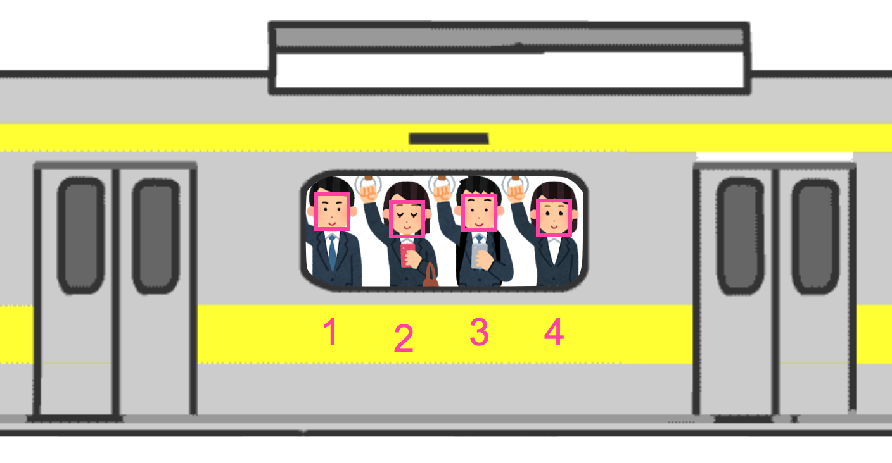
</section>

OK. Let’s start by creating an experiment where we can simulate a moving train!

To simulate a fast moving train we use a photograph. To carry the photograph on the rail, we made a slide frame. How can we move the paper quickly? Should we buy a battery and a motor? Should we use a rubber band? No. Let’s use the earth’s gravity.

We stand the apparatus vertically and rotate the camera 90 degrees. 

<section style="text-align: center;">

</section>

## Cascade classifier / Haar-like feature
--------------------------------------------------------
Now we can introduce a key concept in computer vision. To detect a facial position in an image, we use, as always, OpenCV. OpenCV has various kinds of feature detection technologies but here we are using a “cascade classifier with Haar-like feature”. It is an excellent and robust algorithm. In the following section we will present the essential outline and not get bogged down in details to allow an easier understanding of the concept.  

### Pattern search

In a picture, how can you search a 10x10-pixel square area where the upper half is bright and the lower half is dark? The steps are as follows:

1. Cutout the top-left 10x10 area from the picture.
2. Calculate the brightness average of the upper 10x5 pixel area 
3. Calculate the brightness average of the lower 10x5 pixel area
4. Subtract the lower average from the upper average
5. If the result difference exceeded the predefined threshold, mark here as a candidate on a check buffer

Do the same check by sliding the 10x10 area, pixel by pixel, for the entire screen.
Now we have a "check" buffer with candidate marks. Where the marks are densely gathered, it could be a probable target square location. This will not prove to be difficult as we will see!

<section style="text-align: center;">
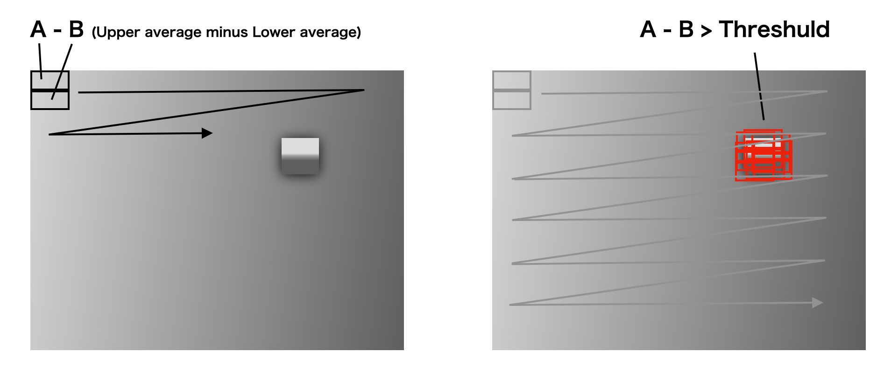
</section>

>To calculate the average of the rectangle area quickly, an algorithm called “integral image” is used. You can find the explanation on the Internet.

### Haar-like feature and Boosting

A Haar-like feature is a set of search areas including a various bright and dark pattern combination. They can be used to specify the region of the localized image pattern. The average black area will be subtracted from the average white area.

<section style="text-align: center;">

</section>

Using the Haar-like feature, a possible facial searching pattern can be formed. It is a 24x24 grid and comprises multiple Haar-like features inside. It could be a set of patterns like the figure below.

<section style="text-align: center;">
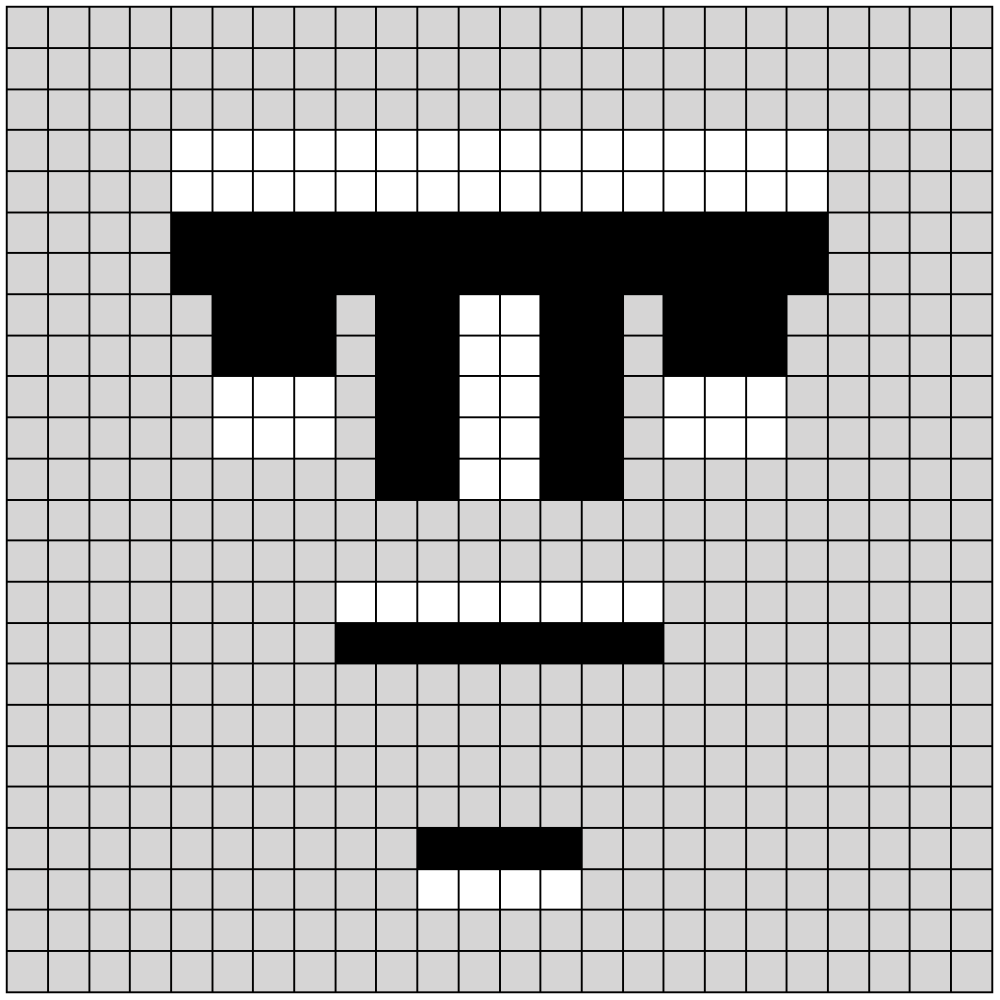
</section>

However, we don’t know how we can form the shape of the facial searching pattern.

In 1990’s, researchers tried to form the shape with the assistance of a computer. First, they prepared hundreds of thousands of patterns (162,336 patterns in a 24x24 grid) by selecting each Haar-like feature, by changing the scale of it and by sliding it in grid unit order. 

<section style="text-align: center;">
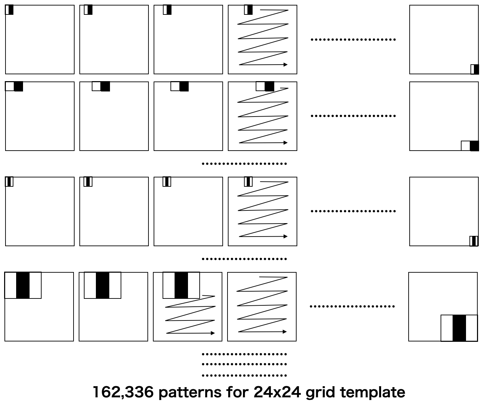
</section>

Next, they collected a huge number of facial pictures and tested the prepared pattern literally hundreds of millions of times to see which combination of the pattern sensed faces at a higher magnitude. Although the prepared patterns were a huge number, they found that most of them are useless. By selecting the good combination of the Haar-like features, they succeeded in reducing the number of the patterns, which of course directly improved the computing performance of the detection algorithm. The pattern reduction technique is called “boosting”. It is an important concept in the computer vision industry. 

The resulting pattern is called a pre-trained model. Luckily we can use various kinds of pre-trained models as many models are available as open-source datasets.

> The model that we use in this project is not simple like the above pattern. It is a combination of more than 6,000 of translated and scaled Haar-like features. But it is still a very small number compared to the possible patterns, which is up to 162,336. 

### Cascading

We now have the pattern set that reacts to the location of faces in a picture. It was generated by training a huge number of existing facial photos. Now we can consider our own high-speed train simulation picture data. If the pattern is like the picture below, we can check the five Haar-like features for a location in the size of the face.

<section style="text-align: center;">
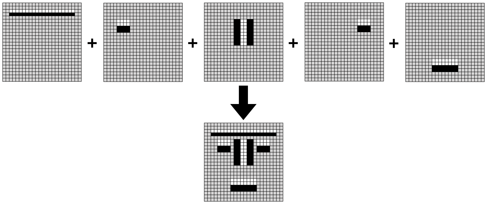
</section>

> Again, our real pattern includes more than 6,000 Haar-like features. Not five.

The most straightforward procedure may work as follows:

1. Define a size of the pattern
2. Decide the location of the pattern
3. Calculate the five features by calculating and comparing the averages of each regions with a threshold
4. If all the five features are marked, then we conclude it is a face.

<section style="text-align: center;">
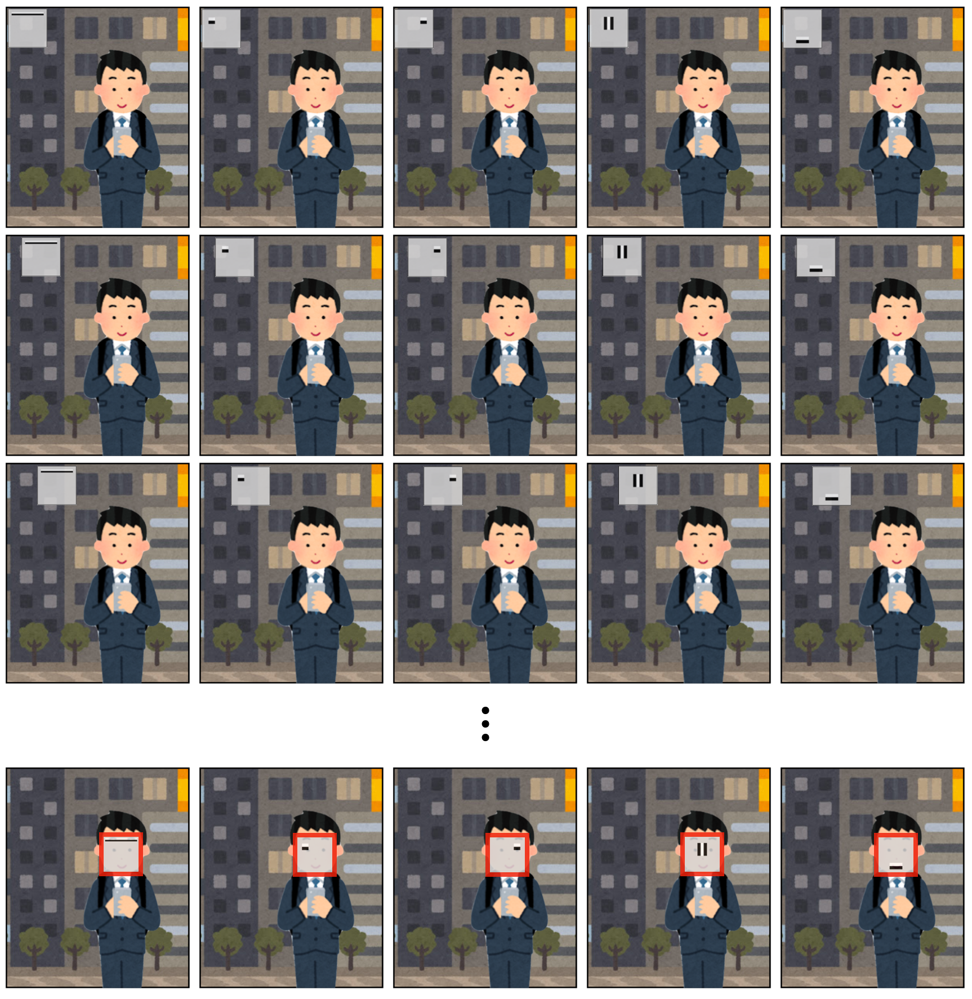
</section>

The result of this procedure is reasonable. However, we need to scan the image from the top left corner to the bottom right corner. We need to scale the 24x24 grid pattern in several sizes in order to detect various sizes of faces in a picture. In addition, the effective face detector for 24x24 grids includes more than 6,000 features. 
This means we still have huge computation challenges in the searching stage.

Don’t worry. We have another acceleration technique!

Each of the 6,000+ features are called a "weak classifier". Single features have a simple edge/stripe detector at a relative location in the 24x24 grid. But using all the 6,000+ features, it can detect more complicated patterns such as faces. The 6,000+ set is called the "strong classifier".

After shaping the facial detector using 6,000+ features, each feature has a weight, which represents the importance of the detection. 

The features are ordered so as to have the important features come earlier and the less important features come later. If we do the pattern search in a 24x24 grid, we calculate the features in the order of importance one-by-one. Thus, instead of gathering all the 6,000+ features calculation for the pattern, we check the result of each feature test one-by-one every time. If it is not marked as a candidate, we pass the rest of the calculation for the current processing 24x24 grid and move the grid to the next scanning location to start the test from the beginning.

<section style="text-align: center;">
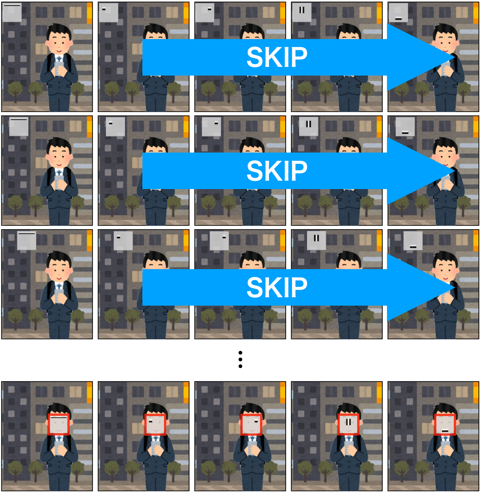
</section>

If the number of faces in a picture is not a huge number, it can greatly reduce the number of the calculation. 

In the real implementation, the features are distributed to 38 groups and the feature test is done at a group unit. The early group includes a small number of important features. The algorithm can go through the non-face region very quickly with a small amount of calculation.

## Decoding And Detection on GPU. Data movement matters.
--------------------------------------------------------
### We need the faster decoder

The Haar-like feature and the OpenCV cascade classifier can deliver practical processing performance.
For a 640x480 movie, we can have more than 10 fps detection speed on an ordinary laptop.

Let’s get back to our point. To get the faces on a passing train, we need to have the processing speed 10 times faster or more. To achieve this we will utilize the GPU which can substantially improve performance.

A modern GPU can process a huge amount of small scale calculation extremely quickly. If the calculations are simple and similar, the optimization level is maximum as the GPU can have thousands of cores that can process the data in parallel. 
Image processing is often "embarrassingly parallel" because the same processing can be applied to each pixel in the same manner repeatedly. This makes image processing an excellent application for GPU acceleration. 

To begin with, Photron's INFINICAM supports the GPU by supporting NVIDIA's CUDA technology to implement the camera decoding (this is the reconstruction on the PC from the data submitted from the camera). CUDA is a development platform for General Purpose GPU (GPGPU) from NVIDIA.

Here is a brief illustration of the INFINICAM dataflow.

<section style="text-align: center;">
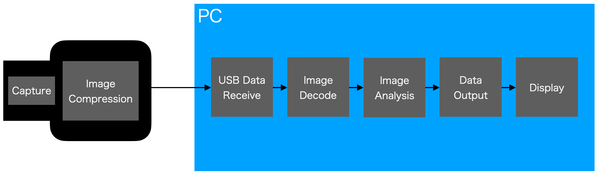
</section>

To transfer the high-speed / high-resolution image data through USB-3, INFINICAM compresses the raw data in the camera hardware using a proprietary compression algorithm in real-time. Next, the data is moved from the INFINICAM camera to the host PC followed by the image decoding (reconstruction) executed on the PC’s processor.

The image decoding is a process that expands the compressed data to the original image. 

The original INFINICAM software supported only the decode on the CPU. Although on CPU, the software is “radically” optimized and uses assembler to achieve pretty good performance to construct the computer vision workflow. 

However, since the decoder runs on the CPU, a CPU based image processing workflow must share the CPU resources with the decoder at a certain extent. That’s why we wanted Photron's SDK has an option to move the decoding from the CPU to GPU even though the CPU decoder itself is fast enough when it only generates pictures.

<section style="text-align: center;">
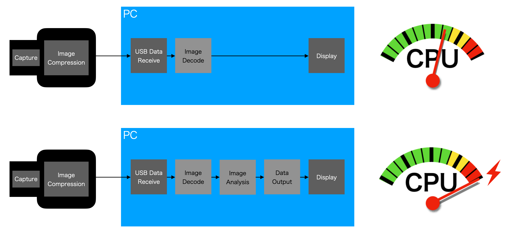
</section>

In case when we use the GPU decoder, the input stream from the camera is compressed data. On the PC, the USB interface device receives the compressed data from system memory and transfers the data to the GPU memory for the decode on the GPU. This enables us to leverage the CPU to do some of the image processing. 

> You can select the decoder from CPU or GPU by calling the respective function in the Photron INFINICAM SDK.

<section style="text-align: center;">
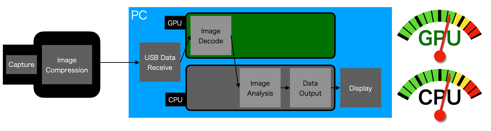
</section>

### Data Movement Matters

After we have the reconstructed image on GPU memory of the PC, in the conventional approach, we need to move the image to CPU memory to apply any OpenCV processing. This is often a bottleneck. When we are dealing with the high-speed movie streams, the data rate is very high, the GPU to CPU data transfer could be the critical bottleneck of the performance regardless of the decoding speed. Decoding on the GPU can free up some CPU power but we need to carefully think about the transfer overhead. In case of the high data rate, keeping all data on the CPU without leveraging the GPU, might lead to better performance after all. 

<section style="text-align: center;">
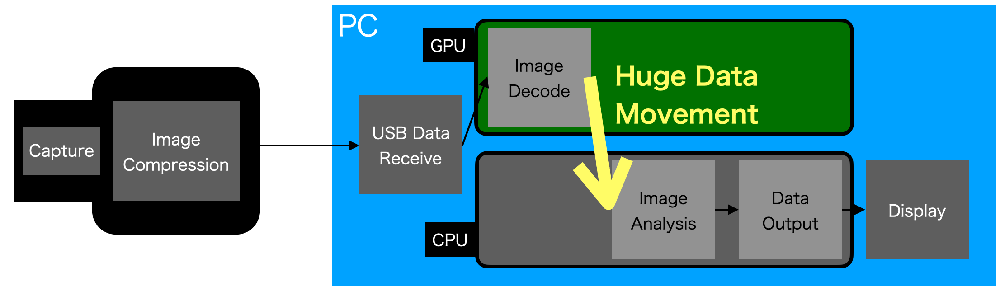
</section>

“faces” uses OpenCV’s cascade classifier. The good news is that OpenCV can be built with a CUDA accelerated version of the cascade classifier. In fact, a lot of OpenCV functions have CUDA accelerated versions. Thus, the ideal performance can be attained by keeping the decoded data on GPU and apply the OpenCV processing on GPU for the data on GPU memory.

### Implementation for the GPU workflow

The essential pseudo code that achieves the end-to-end GPU processing is as follows:

First, we have two global external variables:
```
    static std::vector<cv::Rect> faces;
    static Ptr<cuda::CascadeClassifier> cascade_gpu;
```

The variable “faces” is the array for the detected face location’s x-y coordinate. This is the information we eventually compute. In the overall scheme is a tiny amount of data.

“cascade_gpu” is the pointer to an instance of OpenCV’s cascade classifier class. In the initialization stage, cascade_gpu is created by applying the training data file. The file “haarcascade_frontalface_default.xml” is one of the training data files that are packaged in OpenCV.

```
    cascade_gpu = cuda::CascadeClassifier::create(“haarcascade_frontalface_default.xml”);
```

Next, some camera parameters (resolution and frame rate) are set and the camera device is opened.

```
    photron::PUCLib_Wrapper capGPU;
    capGPU.setResolution(1246, 1008);
    capGPU.setFramerateShutter(1000, 2000);
    capGPU.open(0, false);
```

Photron’s INFINICAM SDK provides an intuitive programing interface for capturing and decoding on the GPU.
We initialize the GPU decoder and start the thread that captures, decodes and analyzes the data on the GPU. 

```
    PUC_GpuInitialize(capGPU.hDevice);
    PUC_BeginXferData(capGPU.hDevice, capThreadGPU, (void *) &capGPU);
    cudaDeviceSynchronize();
```

After the above initialization, the main function loops at a moderate rate of frequency to display the result at, for example, 30 fps. 

Below is the capture/decode/analysis thread.
```
static void capThreadGPU(PPUC_XFER_DATA_INFO info, void* userData)
{
    photron::PUCLib_Wrapper *pCap = (photron::PUCLib_Wrapper *)  userData;
    PUC_DecodeGpuFrame(pCap->hDevice, false, info->pData, &dst_gpu);
    GpuMat frame_gpu(height, width, CV_8UC1, dst_gpu);
    cascade_gpu->setFindLargestObject(false);
    cascade_gpu->setScaleFactor(scaleFactor);
    cascade_gpu->setMinNeighbors(minNeighbors);
    cascade_gpu->setMinObjectSize(cv::Size(minObjSize,minObjSize));
    GpuMat faceBuf_gpu;
    cascade_gpu->detectMultiScale(frame_gpu, faceBuf_gpu)
    cascade_gpu->convert(faceBuf_gpu, faces);
}
```

In the thread function, the camera data is captured and decoded in GPU memory, then transferred to the OpenCV detection function “detectMultiScale”.

There are four “set*” member functions of the cascade_gpu class before the detectMultiScale function. These are the parameter settings of the detection. Because the “faces” application can adjust the detection parameters dynamically whilst processing, these setting functions are called at every timing just before the detection.

The convert function is used to change the GPU internal format of the detected facial coordinate information to the CPU memory array for the further usage of the result.

### Data Movement Does Not Matter

Next, we move the data from GPU to CPU for the array “faces''. This array is just coordinate / size information of the rectangles. It is a very small amount of data and the transfer overhead can be ignored. 

In reality there is another data movement between the CPU and the GPU. It takes place when the image data comes from the camera through USB3. But remember that the data is compressed (less than one-fourth compared to the raw image). It is not small like the "faces" array but the overhead is reduced due to the compression.

<section style="text-align: center;">
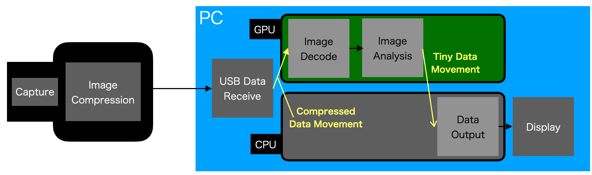
</section>

In addition, if you wanted to display the captured movie, we needed to transfer the data from GPU to CPU. The INFINICAM and the software can capture and process the stream at a very high rate. In the case of the “faces” application for example, it approaches 600 fps depending on the object condition. On the other hand, we can display the movie on a PC monitor at much lower refresh rate such as 30fps. 

It means that we should just move the data from GPU to CPU once every 20 frames or so.

Thus, the data movement between GPU and CPU will not be a bottleneck.

### The heavier CPU processing, the more important to think about GPU

We just went through the GPU processing flow for a real-world computer vision algorithm using th INFINICAM SDK. A naive implementation of the algorithm would result in bottlenecks that would not allow us to take advantage of the high fps of INFINICAM. But when you design the workflow with performance in mind from the start you can achieve amazing performance. 

If the image processing is relatively light, you can stay in CPU decode and CPU OpenCV. For instance, simple image transformations like threshold, cvtColor or integral are fine to run on the CPU. Some structural analysis like findContours, minAreaRect are also light and fast to execute on the CPU.

On the other hand, processing like machine learning algorithms and precise stereo processing are heavy in computation and you can take advantage of the GPU workflow available in the INFINICAM SDK. We are talking about 1000 frames per second!

## Cuda Implementation Tips
--------------------------------------------------------
In our open source sample "faces", we have three modes of facial detection processing.

1. Live Mode
2. RecReady / Rec Mode
3. Playback Mode

While explaining the behavior of each mode, we also show you some implementation tips.

### Live Mode

When you launch the application, it runs in Live Mode. In the Live Mode, the software captures and tries to detect faces as fast as possible. Then it displays the detection result at 30 fps. This means that the "capture + analysis" and "display" are asynchronous. To achieve it, we have two external variables for the GPU decode result and the GPU processing result:

```
static unsigned char* dst_gpu;
static std::vector<cv::Rect> facesGUI;
```

In the GPU thread, the decode data is stored in the GPU memory at the dst_gpu pointer, with which we can move the data to the CPU in the main thread.

```
  PUCRESULT result = PUC_DecodeGpuFrame(pCap->hDevice, false, info->pData, &dst_gpu);
```

On the other hand, the detection result is stored in the CPU memory directly. It is copied to another variable (facesGUI) for GUI display to avoid race conditions.

```
  GpuMat faceBuf_gpu;
  cascade_gpu->detectMultiScale(frame_gpu, faceBuf_gpu);
  cascade_gpu->convert(faceBuf_gpu, faces);

  {
    lock_guard<mutex> lock(mtx);
    facesGUI = faces;
  }
```

In the main thread, the decoded data on the GPU is copied to the CPU every 1/30 seconds:

```
  unsigned char* dst;
  dst = (unsigned char* )malloc(width * height);
         .
         .
         .
  cudaStatus = cudaMemcpy(dst, dst_gpu, width * height * sizeof(unsigned char), 
                          cudaMemcpyDeviceToHost);
  Mat fullFrame = Mat(height, width, CV_8UC1, dst);
```
dst is converted to an OpenCV Mat structure and used for the display including rectangle drawing. To draw the face rectangles, the facesGUI array is used.

```
      for(int ii=0;ii<facesGUI.size();ii++){
        cv::Point pt0, pt1;
        pt0.x = facesGUI[ii].x;
        pt0.y = facesGUI[ii].y;
        pt1.x = facesGUI[ii].x+facesGUI[ii].width;
        pt1.y = facesGUI[ii].y+facesGUI[ii].height;
        cv::rectangle(fullFrame, pt0, pt1, cv::Scalar(255), 2);
      }
```

> In the "faces" application, we have a capability of CPU/GPU toggle switch to demo the performance. Some GUI related real implementation is different from what we explain here.

### RecReady / Rec Mode

"faces" application can record the high-speed movie and the processing result (the location of the faces). But it does not record them in the Live Mode. If the mode is set to RecReady, it starts the recording when a trigger event happens in the captured image. The event is "detection of at least one face". After it starts the recording, it saves the captured high-speed images in the GPU memory as well as the coordinate data of the faces in the CPU memory. The recording duration can be set by the GUI as the "Rec. Duration".

The data arrays (std::vector) are declared as external variables:

```
static std::vector <GpuMat> fBufGPU;
static std::vector < std::vector < cv::Rect > > facesVec;
```
fBufGPU is the array sitting on the GPU memory while facesVec is the CPU array.

In the GPU thread, the trigger recording is operated as follows:
```
  if(recReady){ // set by a GUI button
    if(faces.size() > 0 || recTriggered){
      recTriggered = true;
      if(fBufGPU.size() < recDuration){
        GpuMat tmp;
        frame_gpu.copyTo(tmp);
        fBufGPU.push_back(tmp);
        facesVec.push_back(faces);
      }else{
        recReady = false;
        recTriggered = false;
      }
    }
  }
```
As you can see in the code above, the image data “frame_gpu” is stored in the fBufGPU array on GPU while the face coordinate / size information is stored in the facesVec array on CPU. Then we can go to the Playback mode.

### Playback Mode

To display the image data on the GPU, we use the download function of the GpuMat object of cuda-OpenCV. Below is the code to copy the images on GPU(fBufGPU) to CPU(fBufMat) and draw rectangles on the detected faces.

```
for(int i=0;i<recDuration;i++){
  cv::Mat fBufMat;
  fBufGPU[i].download(fBufMat);
  for(int ii=0;ii<facesVec[i].size();ii++){
    cv::Point pt0, pt1;
    pt0.x = facesVec[i][ii].x;
    pt0.y = facesVec[i][ii].y;
    pt1.x = facesVec[i][ii].x+facesVec[i][ii].width;
    pt1.y = facesVec[i][ii].y+facesVec[i][ii].height;
    cv::rectangle(fBufMat, pt0, pt1, cv::Scalar(255), 2);
  }
  imshow("Infinicam: Faces", fBufMat);
  int key;
  key = waitKey(33);
  if(key == 0x1b){
    exit(0);
  }
}
```
The code above shows that it plays back the stored image with a facial rectangle at approximately 30 fps. It exits the program when you hit ESC (0x1b) on the OpenCV window.

## Operation Example
--------------------------------------------------------
- Connect INFINICAM with a USB-3 cable to your PC.

- Double click the execution file.

- The Faces menu window and the main monitor window (Infinicam: Faces) will show up.

<section style="text-align: center;">
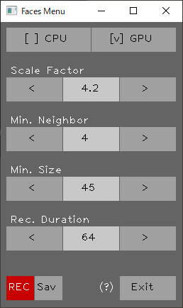
</section>

<section style="text-align: center;">
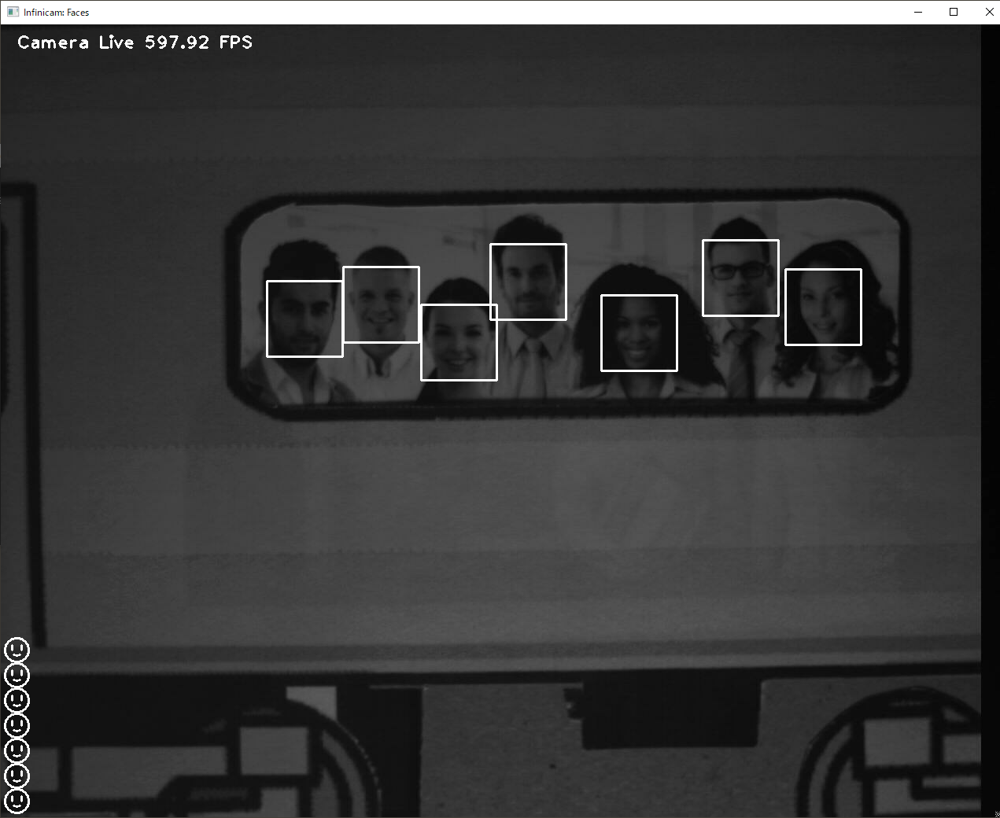
</section>

- The initial mode is Live mode. The above screenshot shows that the capture image is decoded and processed at about 600 fps. But the display is 30 fps. White rectangles are placed on the detected faces. You can check the detected face number as seven smiley faces at the lower left corner.

- You can move the photo quickly to see if the detection continues to be stable.

<section style="text-align: center;">

</section>

- If you do the same thing with the 30 fps camera, the detection fails when the object is moving because of the motion blur.

<section style="text-align: center;">

</section>

- Next, simulate the passing train. Slide up the train picture until no faces show up in the monitor. 

- Hit the REC button at the lower left corner of the GUI menu. It changes to the Rec Ready mode.

- Drop the train picture. The recording starts automatically when one of the faces is shown in the UI and detected. It continues the recording for the duration of the Rec. Duration (frames).

- After the recording is finished, it goes to Playback mode that loop-plays the recorded result. Below are screenshot comparisons of 600 fps processing and the 30 fps processing.

<section style="text-align: center;">

</section>

> The above operation example is done on a Laptop PC with the following specification:
> - AMD Ryzen7 5800H Processor (3.2GHz/4.4GHz)
> - Tertiary Cache 16MB
> - 16GB Main Memory
> - NVIDIA GeForce RTX 3070 8GB Video Memory
> - Windows 10 Home edition

## Environment
--------------------------------------------------------
* Install Visual Studio 2019

    :warning: MFC Package is required.

* OpenCV Version 4.2.0 or higher. 

* For the GPU processing, NVIDIA Graphics card and CUDA SDK 11.7. 

## Build
--------------------------------------------------------
1. Download and install [PUCLIB](https://github.com/infinicam/infinicam-samples) SDK.

2. Clone this source code.
   
3. Open [faces.sln](https://github.com/infinicam/DecodeCuda/faces/faces.sln) on visual studio.

4. Build

## Discussion
--------------------------------------------------------
### Is 500 fps really needed?

We just showed you that we are able to count persons on a passing train at 500 fps or faster with INIFINICAM using GPU. But you may ask if 500 fps is really needed and would a normal 30 fps camera be sufficient? To answer this question we can think about the theoretical aspects of the problem.

An express train is passing through a local station at the speed of 30 miles per hour. It is 13.4 meters per second.

If we filmed the passing train at 30 fps, the face moves about 45 cm in the duration of one frame. If it is at 500 fps, the face moves only 2.7 cm in one frame.

<section style="text-align: center;">
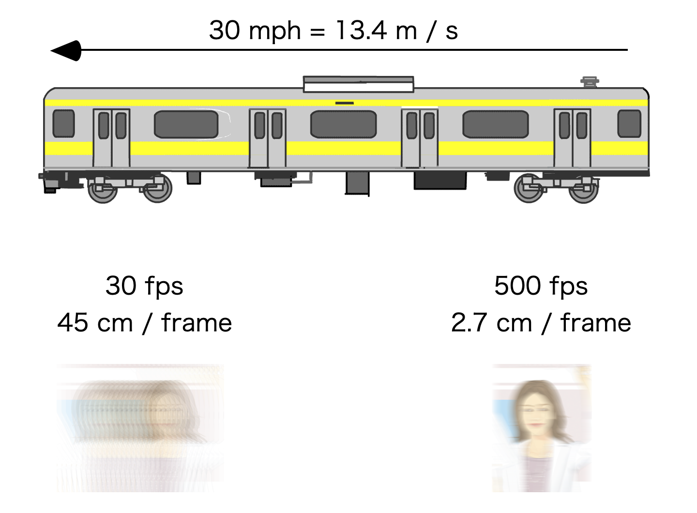
</section>

It is obvious that a slower camera could capture only blurred targets and not good source imagery for computer vision analysis. 
If the object does not move so fast then 30 fps is OK. But if you deal with fast moving objects then high-speed capture is critical and high speed processing makes a huge difference.

### Short Shutter Speed for 30 fps

Even using a 30 fps camera, there is a workaround to get sharper images. If you can have a rapid shutter speed, you can get a clear image with less motion blur. But there are still some advantages to using a high-speed camera. Even though the processing result for a single frame is similar, we can enjoy the advantage of INFINICAM.

INFINICAM can get a lot more data than a normal camera from a unit time perspective. After extracting some position and shape data from the image, the temporally dense data can deliver better recognition. The illustration below shows that we can make use of temporal coherency to identify the points to get the optical flow. Even though the short shutter speed 30 fps camera can make an identical output from a single frame, it is impossible to get the same temporal information from the adjacent frames. The benefits of the high-speed workflow for the high-speed transport are obvious and critical for real-world analysis in this domain.

<section style="text-align: center;">
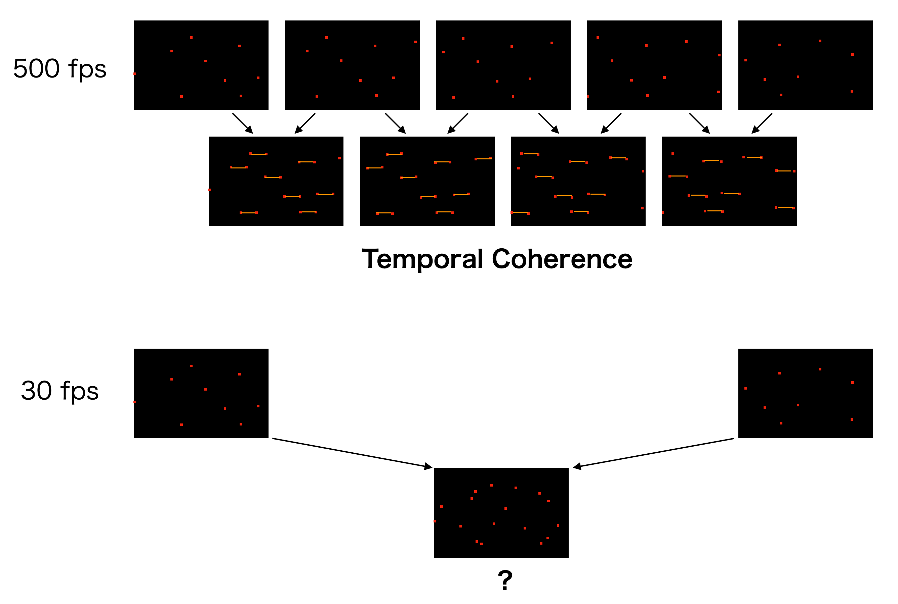
</section>

### CPU/GPU switching

The "faces'' application has the capability of running on both the CPU and the GPU to allow you to evaluate the performance. The open source program includes the technique of how you can initialize the CPU decoder and GPU decoder as well as the OpenCV aspects of the implementation. We observed an interesting behavior through the faces project: the CPU is generally slower but in case the cascade classifier has no detection, sometimes CPU processes of images are faster than the GPU. Once a face appears on the screen, then the CPU is much slower than the GPU.

We estimate that the many core CPU may sometimes enable very good performance depending on the exact nature of the processing algorithm. 

## Faces application GUI guide
--------------------------------------------------------
<section style="text-align: center;">

</section>

- **[ ]CPU / [ ]GPU**
 Toggles CPU process and GPU process. It effects both for decoding and facial detection.

- **Scale Factor**
When doing the facial detection, after scanning the whole screen with a size of the search window, the size is changed by multiplying the Scale Factor and does the scanning again, repeatedly. Usually a factor of 1.1 works fine to enable better detection since the search size gradually changes and possibly fits various sizes of faces. But having the Scale Factor closer to 1.0 means the iteration number increases and the entire processing time increases. On the other hand, having some bigger Scale Factor like 5, the iteration number reduces. If you can limit the size of faces in a certain range, you can adjust the Min.Size (see below) and the Scale Factor properly to get better performance whilst keeping good detection.

- **Min. Neighbor**
If the search window approaches the face location closely, it detects the faces at the several neighboring points of the face, when the eyes and nose are in the window. Min. The "Min. Neighbor parameter defines the threshold of how many detects can exist closely to allow the "faces" to decide it is a face. If you set this parameter to one, it will often detect non-facial areas. In addition, a lot of sub-detection appears around the real face. If you set this parameter to a large value, such as 5 or 6, then it often fails to detect the real faces. 4 works fine in many cases.

- **Min. Size**
This defines the minimum size of the search window. To search smaller faces in the screen, make this parameter small but the processing speed decreases. If the target face size is bigger than some pixel size on the screen, then make "Min. Size" parameter as close as the size to get a faster processing performance. 

- **Rec. Duration**
The system moves to RecReady status if you click the REC button. When at least one face is detected, then it starts the recording. "Rec. Duration" defines the duration of the recording (the units are in frame number).

- **REC/CAM/STOP**
The left-bottom button of the Menu window changes the operation mode to REC/CAM/STOP. 
  - REC: If you click this button in Live mode (initial mode), it changes to RecReady mode. When at least one face is detected, then it starts the recording. 
  - CAM: If you click this button in RecReady mode or PlayBack mode, it goes back to the Live mode. If the system is recording the image, this button is changed to STOP. 
  - STOP: If you click this button in Rec mode, it goes to the PlayBack mode. If the recording starts after the first detection, it continues the recording even when it fails to detect the recording. After the "Rec.Duration" has elapsed, the REC automatically stops and goes back to PlayBack mode. 

  (In PlayBack mode, hit the spacebar key to pause the looping. You can use an arrow key to step forward the paused video (reverse stepping is currently not supported). Hit the spacebar key again to go back to the playback mode.)

- **Sav**
Save the setting parameters. The saved parameter is automatically loaded the next time the program is launched.

- **Exit**
Exit the application. If you are in the Step Forward mode, hit the spacebar key to activate the Exit button.

#### developed by: Photron Ltd.


